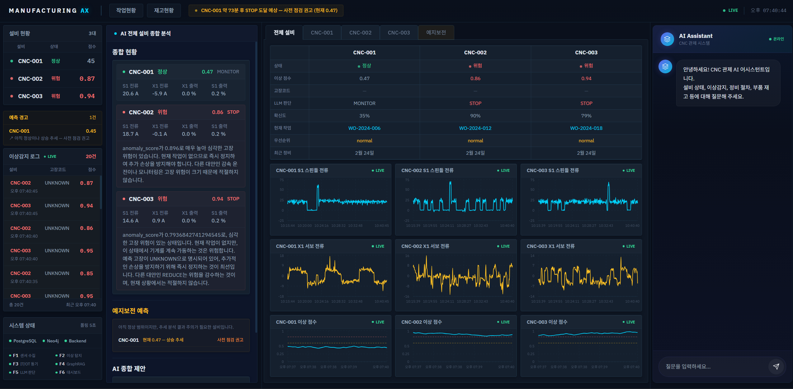
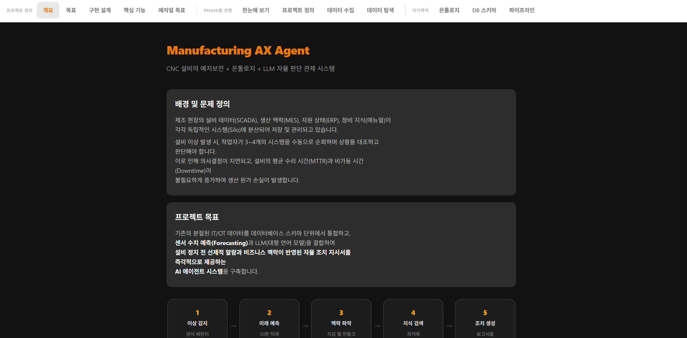

<div align="center">

# Manufacturing AX Agent

**CNC 제조 설비의 예지보전 + 온톨로지 기반 GraphRAG + LLM 자율 조치**<br/>
**에이전트 관제 시스템**

센서 이상탐지부터 LLM 조치 판단까지, AI가 자동으로 순회 → 분석 → 조치를 제안합니다.

<br/>

[](https://python.org)
[](https://fastapi.tiangolo.com)
[](https://react.dev)
[](https://vitejs.dev)
[](https://postgresql.org)
[](https://neo4j.com)
<br/>
[](https://pytorch.org)
[](https://openai.com)
[](https://docker.com)
[](LICENSE)

</div>

<div align="center">

<br/>

### AI 자율 판단 관제 시스템

<!-- 메인 대시보드 스크린샷 -->


<br/>

<!-- 데모 영상 -->
https://github.com/user-attachments/assets/a3f8a1e7-ae99-4b52-afc5-2d4c11ca3d9c

<br/>

센서 이상을 실시간 감지하고, 1D-CNN이 n초 후를 예측합니다.<br/>
Neo4j 온톨로지가 고장 원인 → 필요 부품 → 정비 매뉴얼을 연결하고,<br/>
GPT-4o-mini가 비즈니스 맥락을 종합하여 **STOP / REDUCE / MONITOR 조치를 자율 판단**합니다.

<br/>

### 개발 과정 한눈에 보기

Phase 0~3 전체 진행 과정, EDA, 온톨로지, 파이프라인 설계를 인터랙티브하게 탐색할 수 있습니다.

<a href="https://young-shadow-e405.rlawlsdnr430.workers.dev/" target="_blank"></a>

위 배너를 클릭하면 프로젝트 전체 과정을 인터랙티브하게 확인할 수 있습니다.

<!-- 리뷰 대시보드 스크린샷 -->


</div>

---

## Problem

제조 현장에서 설비 이상이 발생하면, 작업자는 **3~4개의 분산된 시스템**을 직접 순회해야 합니다.

```
SCADA (센서 수치 확인) → MES (현재 작업/납기 확인) → ERP (부품 재고 확인) → 매뉴얼 (조치 방법 탐색)
```

이 수동 프로세스로 인해 **의사결정이 지연**되고,<br/>
설비의 평균 수리 시간(MTTR)과 비가동 시간(Downtime)이 증가하여 생산 원가 손실이 발생합니다.

## Solution

<div align="center">

| 기존 (수동) | 이 시스템 (AI 지원) |
|:----------:|:------------------:|
| 작업자가 센서 수치를 보고 이상 감지 | Isolation Forest + 1D-CNN이 **자동 판별** |
| 고장 발생 후 사후 대응 | 시계열 예측(1D-CNN)으로 **고장 전 선제 알람** |
| 작업자가 MES/ERP를 수동 조회 | 알람 시점 기준으로 **자동 조회** |
| 작업자가 매뉴얼을 찾아 대조 | Neo4j 온톨로지 + GraphRAG로 **자동 검색** |
| 작업자가 경험에 의존해 판단 | LLM이 컨텍스트를 종합하여 **조치 자동 생성** |

</div>

## Expected Impact

<div align="center">

| 지표 | 효과 |
|:----:|:----:|
| **MTTR 단축** | 이상 감지 → 조치 지시까지 시간 대폭 단축 |
| **선제적 대응** | 1D-CNN이 n초 후 센서값 예측 → 고장 전 알람 |
| **판단 품질** | 납기, 재고, 정비 이력을 종합한 근거 기반 의사결정 |
| **지식 표준화** | 숙련자 경험 → 온톨로지 + LLM으로 체계화 |

</div>

---

## Architecture

### 핵심 파이프라인 (F1 → F6)

```
                    ┌─────────────────────────────────────────┐
                    │            센서 데이터 (100ms)            │
                    └───────────────────┬─────────────────────┘
                                        │
                                        ▼
                    ┌─────────────────────────────────────────┐
                    │         F1: 수집 / 전처리                 │
                    │         42컬럼 → snake_case → DB          │
                    └───────────────────┬─────────────────────┘
                                        │
                                        ▼
                    ┌─────────────────────────────────────────┐
                    │      F2: 이상탐지 (IF) + 예측 (1D-CNN)    │
                    │      융합 점수 = 0.6×IF + 0.4×Forecast    │
                    └──────────┬───────────────┬──────────────┘
                               │               │
                     is_anomaly = true?         │
                               │               │
                ┌──────────────▼──────┐  ┌─────▼─────────────┐
                │  F3: IT/OT 동기화    │  │  F4: GraphRAG      │
                │  ┌────────────────┐ │  │  ┌───────────────┐ │
                │  │ MES 작업/납기   │ │  │  │ Neo4j 온톨로지  │ │
                │  │ ERP 부품 재고   │ │  │  │ pgvector 매뉴얼 │ │
                │  │ CMMS 정비 이력  │ │  │  │ 과거 정비 이력  │ │
                │  └────────────────┘ │  │  └───────────────┘ │
                └──────────┬──────────┘  └─────┬─────────────┘
                           │                   │
                           └─────────┬─────────┘
                                     │
                                     ▼
                    ┌─────────────────────────────────────────┐
                    │         F5: LLM 자율 판단                 │
                    │         GPT-4o-mini (JSON mode)           │
                    │         → STOP / REDUCE / MONITOR         │
                    └───────────────────┬─────────────────────┘
                                        │
                                        ▼
                    ┌─────────────────────────────────────────┐
                    │         F6: 관제 대시보드 + AI 챗봇        │
                    │         React 18 · Palantir 3-Pane        │
                    └─────────────────────────────────────────┘
```

### F2: 이상탐지 + 예지보전

<div align="center">

```
센서 300행(30초) → [Isolation Forest] → IF 점수 (현재 이상 여부)
센서 300행(30초) → [1D-CNN Forecaster] → Forecast 점수 (미래 예측)
                         │
              융합 점수 = 0.6 × IF + 0.4 × Forecast

      성능: 분리도 0.051(IF) → 0.384(IF+CNN) — 7.5배 향상
```

</div>

### 온톨로지 구조 (Neo4j — 120노드, 337관계)

```
Equipment ──[HAS_SENSOR]──→ Sensor ──[DETECTS]──→ FailureCode
    │                                                  │
    ├──[EXPERIENCES]──→ FailureCode ──[REQUIRES]──→ Part
    │                       │
    ├──[EXECUTES]──→ WorkOrder   FailureCode ──[DESCRIBED_BY]──→ Document
    │                                                              │
    └──[triggers]──→ MaintenanceAction ──[REFERENCES]──→ Document
                          │
                          ├──[RESOLVES]──→ FailureCode
                          └──[CONSUMES]──→ Part
```

---

## Tech Stack

<div align="center">

| 영역 | 기술 | 비고 |
|:----:|:----:|:----:|
| **Backend** | Python · FastAPI | 타입 힌트 · 한국어 주석 |
| **Database** | PostgreSQL 16 (TimescaleDB + pgvector) | 시계열 + 벡터 통합 |
| **Graph DB** | Neo4j 5 Community | 온톨로지 + GraphRAG |
| **ML** | Isolation Forest + 1D-CNN (PyTorch) | ADR-001, ADR-007 |
| **LLM** | OpenAI GPT-4o-mini | JSON mode · 환각 검증 |
| **Frontend** | React 18 + Vite + TanStack Query + Recharts | ADR-006 |
| **Infra** | Docker Compose | PG + Neo4j 컨테이너 |

</div>

---

## Dashboard

### 메인 화면 — 전체 설비 모니터링

4패널 레이아웃: **설비 현황 | AI 분석 | 모니터링 센터 | AI 챗봇**

- **설비 현황** — CNC-001/002/003 상태, 이상감지 로그 (실시간), 시스템 상태 (F1~F6)
- **AI 분석** — 설비별/알람별 분석, 전체 종합 분석, 예지보전 분석
- **모니터링** — 종합 테이블 + 4축 전류/출력 파워/이상 추이 차트
- **AI 챗봇** — 실시간 DB 데이터 기반 질의응답 (GraphRAG + pgvector + Neo4j)

### 설비별 상세 모니터링

탭 전환: `전체 설비 | CNC-001 | CNC-002 | CNC-003 | 예지보전`

- KPI 5개 (이상점수, 고장코드, LLM판단, 현재작업, 확신도)
- 4축 전류 비교 차트, 출력 파워 차트
- 이상 점수 추이 (STOP/REDUCE 기준선)
- 정비 이력 + 작업지시 + LLM 판단 내역

### 예지보전 탭

- IF 탐지 점수 vs CNN 예측 점수 비교 차트 (3대 설비 동시)
- 추세 분석 + STOP 도달 예상 시점
- 위험 센서 분석 (고장코드 → 센서 매핑)
- CNN 예측 상승 시 AI 분석 패널에 자동 경고

---

## Data

<div align="center">

### Kaggle CNC 밀링 데이터셋

| 항목 | 값 |
|:----:|:---:|
| 실험 | 18개 (unworn 8 + worn 10) |
| 센서 | 42컬럼 (4축 × 11센서 + feedrate + process) |
| 총 행 | 25,286행 |
| 샘플링 | 100ms |
| 설비 | CNC-001 / CNC-002 / CNC-003 |

### 합성 데이터 (MES / ERP / CMMS)

| 테이블 | 건수 | 용도 |
|:------:|:----:|:----:|
| mes_work_orders | 18건 | 작업지시 |
| maintenance_events | 39건 | 정비 이력 |
| erp_inventory | 35건 | 부품 재고 (7주 × 5종) |
| maintenance_manuals | 12건 | 정비 매뉴얼 (4고장 × 3유형) |
| document_embeddings | 47청크 | pgvector 384차원 |

### 고장코드 (4종)

| 코드 | 설명 | 심각도 |
|:----:|:----:|:------:|
| TOOL_WEAR_001 | 엔드밀 마모 | Critical |
| SPINDLE_OVERHEAT_001 | 스핀들 과열 | Critical |
| CLAMP_PRESSURE_001 | 클램프 압력 저하 | Warning |
| COOLANT_LOW_001 | 냉각수 부족 | Warning |

</div>

---

## Quick Start

### 1. 인프라 실행

```bash
docker compose up -d          # PostgreSQL + Neo4j
```

### 2. 백엔드 실행

```bash
cd backend
pip install -r requirements.txt
echo "OPENAI_API_KEY=sk-..." > .env
uvicorn app.main:app --host 0.0.0.0 --port 8000
```

### 3. 프론트엔드 실행

```bash
cd frontend
npm install
npm run dev                   # → http://localhost:5173
```

### 4. 데이터 초기화 (최초 1회)

```bash
cd backend
python load_data.py batch     # 센서 + MES/ERP 데이터
python embed_manuals.py       # 정비 매뉴얼 → pgvector
python init_neo4j.py          # Neo4j 온톨로지 생성
python train_f2.py            # IF 모델 학습
python train_f2_forecast.py   # 1D-CNN 모델 학습
python backfill_forecast.py   # forecast_score 채우기
```

---

## File Structure

```
Manufacturing-ax-agent/
├── backend/
│   ├── app/
│   │   ├── api/routes.py           # 14개 API 엔드포인트
│   │   ├── config.py               # 설정값 20+ 파라미터
│   │   ├── models/schemas.py       # Pydantic 스키마
│   │   └── services/
│   │       ├── anomaly_detector.py  # F2: Isolation Forest (16피처)
│   │       ├── forecaster.py        # F2: 1D-CNN Forecaster (4피처)
│   │       ├── itot_sync.py         # F3: IT/OT 동기화
│   │       ├── graphrag.py          # F4: Neo4j + pgvector
│   │       ├── llm_agent.py         # F5: GPT-4o-mini 판단
│   │       ├── chat_agent.py        # AI 챗봇 (3소스)
│   │       ├── db.py                # 커넥션 풀
│   │       └── main_loop.py         # F1→F2 폴링 루프
│   └── models/                      # 학습된 모델 (.pkl)
├── frontend/
│   └── src/
│       ├── components/layout/       # AppShell, Sidebar, Topbar, AiDetailPanel
│       ├── components/dashboard/    # MonitoringCenter, ChatFab
│       ├── hooks/                   # TanStack Query 훅
│       ├── stores/                  # Zustand 전역 상태
│       └── lib/api/                 # API 클라이언트
├── db/
│   ├── init.sql                     # PostgreSQL 11테이블
│   └── init_neo4j.cypher            # Neo4j 초기화
├── docs/
│   ├── adr/                         # ADR 8건 (000~007)
│   ├── progress/phases/             # Phase 0~3 로그
│   └── prompts/                     # 매뉴얼 생성 프롬프트
├── docker-compose.yml
└── CLAUDE.md
```

---

<div align="center">

This project is for educational purposes.

</div>
