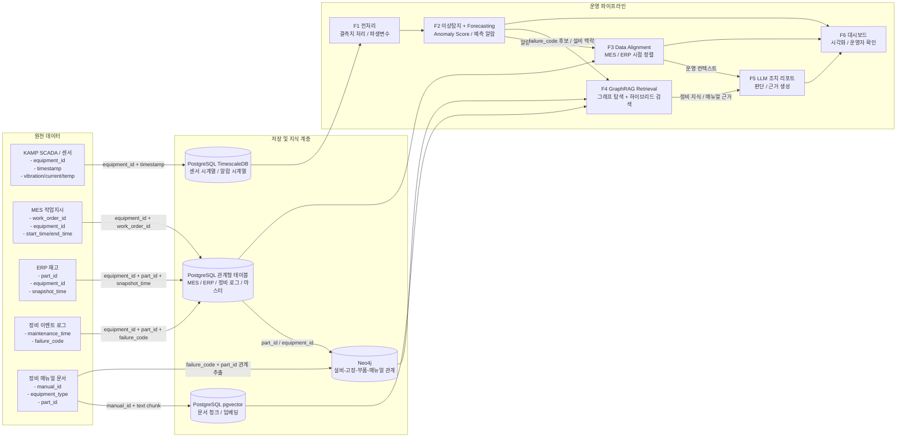

# 예지보전·이상탐지·온톨로지 데이터 수집 및 데이터셋 전략

**상태:** Draft (검토 중)
**최종 수정일:** 2026-03-09

이 문서는 제조 AX 개인 프로젝트에서 예지보전, 이상탐지, 온톨로지 기반 LLM 기능을 구현하기 위해
왜 어떤 데이터가 필요한지, 무엇을 어디서 어떻게 확보할지, 그리고 어떤 우선순위로 수집·보강해야 하는지 정리합니다.

기존의 [prd-v1.0.md](prd-v1.0.md)를 보완하는 문서입니다.
특히 아래 질문에 답하는 것을 목표로 합니다.

- 예지보전에는 정말 고장 시점 데이터가 꼭 필요한가?
- 이상탐지는 고장 이력 없이도 시작할 수 있는가?
- 온톨로지와 GraphRAG를 위해 어떤 종류의 데이터를 따로 모아야 하는가?
- 지금 당장 모을 수 있는 데이터와 나중에 보강해야 할 데이터는 무엇인가?

Phase 0에서는 이 문서를 데이터 수집 관련 기준 문서로 사용합니다.

---

## 1. 핵심 원칙

이 프로젝트에서 데이터 수집은 "많이 모으기"보다 "판단에 필요한 형태로 연결하기"가 더 중요합니다.

핵심 원칙은 다음 5가지입니다.

1. 모든 데이터는 가능하면 `equipment_id`와 `timestamp`를 기준으로 연결 가능해야 합니다.
2. 센서 데이터만으로 시작할 수 있는 기능과, 이벤트·정비 이력이 있어야 가능한 기능을 구분해야 합니다.
3. 온톨로지 데이터는 텍스트 문서 수집과 별개로, 개체(Entity)와 관계(Relation)를 먼저 정의해야 합니다.
4. 합성 데이터(MES/ERP)는 보기 좋은 표가 아니라, LLM 판단이 달라지는 시나리오를 만들 수 있어야 합니다.
5. 모든 파이프라인은 원본 데이터 형식이 아니라, 내부 표준 형식(Canonical Model)을 기준으로 설계해야 합니다.

> **주의:** 이 원칙은 Phase 0에서 "정확한 컬럼을 지금 확정하자"는 뜻이 아닙니다.
> 현재 단계에서는 내부 표준 형식을 만들겠다는 설계 원칙만 확정하고,
> 실제 표준 컬럼과 도메인 모델은 Phase 1 EDA와 Phase 2 아키텍처 설계에서 구체화합니다.

또한 이 문서는 아래 ADR 결정과 직접 연결됩니다.

- ADR-000: CNC 단일 도메인 유지
- ADR-001: RUL 대신 Forecasting 기반 접근
- ADR-002: MES/ERP 합성 생성
- ADR-003: PostgreSQL 기반 통합 저장 전략
- ADR-004: 5초 폴링 기반 실시간성 모사

---

## 2. 데이터셋 전체 맵

현재 프로젝트에서 필요한 데이터셋은 아래 5종으로 정리할 수 있습니다.

| 기능 | 필요 데이터 | 도메인 | 확보 방법 | 상태 |
|------|-------------|--------|-----------|------|
| F1, F2 | CNC 센서 데이터 (SCADA) | CNC 가공 | KAMP 공공 데이터 | 확보 방안 확정 |
| F3 | 작업 지시 내역 (MES) | CNC 가공 | 합성 생성 (ADR-002) | 설계 필요 |
| F3 | 부품 재고 현황 (ERP) | CNC 가공 | 합성 생성 (ADR-002) | 설계 필요 |
| F4 | 설비-고장-부품-매뉴얼 관계 (Ontology) | CNC 가공 | 미정 | ADR 필요 |
| F4 | 정비 매뉴얼 텍스트 | CNC 가공 | 미정 | ADR 필요 |

이 표는 "무엇을 확보해야 하는가"를 빠르게 보는 요약 맵이고,
이후 섹션에서는 왜 필요한지와 어떻게 접근할지를 같이 설명합니다.

---

## 3. 예지보전과 이상탐지의 데이터 요구 수준 차이

예지보전과 이상탐지는 비슷해 보이지만, 실제로 필요한 데이터 수준이 다릅니다.

### 3.1. 이상탐지

이상탐지는 "평소와 다른 패턴"을 찾는 문제입니다.

따라서 최소한의 정상 센서 데이터만 있어도 시작할 수 있습니다.
다만, 이상의 원인과 실제 고장 가능성까지 강하게 설명하려면 추가 맥락이 필요합니다.

### 3.2. 예지보전

예지보전은 "미래의 고장 위험"을 미리 포착하는 문제입니다.

이 프로젝트는 RUL 예측이 아니라 Forecasting 기반 접근을 채택하므로,
미래 센서값과 위험 임계치 돌파 가능성을 보는 방향이 전제됩니다. (ADR-001 참조)

센서 패턴만으로도 위험 신호를 만들 수는 있지만,
그 신호가 실제 정비 필요 상황과 연결되는지 설명하려면 아래 정보가 중요합니다.

- 고장 또는 이상 이벤트 시점
- 정비 직전과 직후의 패턴 변화
- 어떤 부품이 언제 교체되었는지에 대한 이력
- 당시의 운전 조건과 작업 맥락

즉, 이상탐지는 정상 데이터 중심으로 MVP를 만들 수 있지만,
예지보전은 시간이 갈수록 이벤트 기반 맥락 데이터가 반드시 필요해집니다.

---

## 4. 기능별 필요 데이터

> **주의:** 아래 "필수/중요/보강" 분류는 현재 시점의 설계 가설입니다.
> 실제 KAMP 컬럼과 운영 이벤트 가용성은 Phase 1 EDA 이후 확정합니다.

### 4.1. F1, F2: 예지보전·이상탐지용 데이터

| 구분 | 데이터 항목 | 필요 수준 | 이유 |
|------|-------------|-----------|------|
| 필수 | timestamp | 반드시 필요 | 시계열 정렬 및 윈도우 생성 기준 |
| 필수 | equipment_id | 반드시 필요 | 설비 단위 학습 및 타 시스템 조인 키 |
| 필수 | 진동, 전류, 온도, 회전수 등 센서 시계열 | 반드시 필요 | 이상 패턴 및 미래 위험 신호 탐지 |
| 중요 | 운전 상태(run/idle/stop) | 매우 권장 | 가능하다면 정상 패턴을 운전 모드별로 분리하기 위함 |
| 중요 | 작업 종류 또는 제품 정보 | 매우 권장 | 동일 센서값도 작업 조건에 따라 의미가 달라짐 |
| 중요 | 알람 발생 시점 | 매우 권장 | 위험 점수와 운영 이벤트를 연결하기 위함 |
| 중요 | 정비 시점, 부품 교체 이력 | 매우 권장 | 고장 전조와 실제 정비 필요 상태를 연결 |
| 보강 | 고장 유형 라벨 | 있으면 매우 좋음 | 고장 분류, 정밀 평가, 설명력 향상 |

### 4.2. F3: MES/ERP 동기화용 데이터

| 구분 | 데이터 항목 | 필요 수준 | 이유 |
|------|-------------|-----------|------|
| 필수 | 작업 지시 번호, 설비 ID, 작업 상태 | 반드시 필요 | 알람 시점의 운영 맥락 파악 |
| 필수 | 납기일, 우선순위, 생산 잔량 | 반드시 필요 | 조치 판단의 비즈니스 기준 |
| 필수 | 부품 ID, 재고 수량, 안전 재고, 리드타임 | 반드시 필요 | 즉시 정지 가능 여부 판단 |
| 중요 | 최근 교체일, 예정 정비일 | 매우 권장 | 계획 정비와 긴급 정비 구분 |
| 보강 | 생산 차질 비용, 고객 중요도 | 있으면 좋음 | 의사결정 우선순위 고도화 |

### 4.3. F4: 온톨로지·GraphRAG용 데이터

| 구분 | 데이터 항목 | 필요 수준 | 이유 |
|------|-------------|-----------|------|
| 필수 | 설비 마스터 정보 | 반드시 필요 | 지식그래프의 기준 노드 |
| 필수 | 부품 마스터 정보 | 반드시 필요 | 고장과 부품 관계 연결 |
| 필수 | 고장 코드 또는 고장 유형 | 반드시 필요 | 증상과 조치의 기준 축 |
| 필수 | 증상, 원인, 점검 항목, 조치 절차 | 반드시 필요 | 추론과 검색의 핵심 관계 |
| 필수 | 정비 매뉴얼 문서와 출처 | 반드시 필요 | RAG 검색 근거 |
| 중요 | 동의어 사전, 현장 용어 사전 | 매우 권장 | 검색 누락 방지 |
| 중요 | 문서-설비-부품 연결 메타데이터 | 매우 권장 | 문서 검색 결과를 관계망과 연결 |

F5는 별도 데이터를 새로 수집하는 단계라기보다,
F2, F3, F4에서 수집한 데이터를 어떻게 정렬하고 근거화해서 사용할지의 문제에 가깝습니다.
따라서 본 문서에서는 F5를 독립 수집 항목으로 다루지 않고,
후속 아키텍처 문서에서 데이터 소비 방식으로 정리합니다.

---

## 5. 왜 고장 시점 데이터가 중요한가

센서 데이터만 있으면 "평소와 다르다"는 신호는 만들 수 있습니다.
하지만 그 신호가 실제로 어떤 의미였는지 알려면 이벤트 데이터가 필요합니다.

예를 들어,

- 진동이 급상승했다
- 3시간 뒤 설비가 멈췄다
- 다음날 베어링을 교체했다

이 세 정보가 연결되면, 해당 패턴은 단순 노이즈가 아니라
실제 고장 전조일 가능성이 높다고 해석할 수 있습니다.

즉, 센서는 신호이고,
이벤트 로그와 정비 이력은 그 신호의 의미를 해석하는 근거입니다.

---

## 6. 데이터셋 확보 대상과 방법

### 6.1. 공공 데이터: KAMP CNC 센서 데이터

#### 6.1.1. 데이터 개요

- **출처:** KAMP (한국 AI 제조 플랫폼) 공공 데이터셋
- **대상 설비:** CNC 기계 가공 설비
- **용도:** F1 전처리, F2 이상탐지 및 Forecasting

#### 6.1.2. 우선 확인할 항목

| 항목 | 용도 | 비고 |
|------|------|------|
| 진동(Vibration) | 이상 탐지, 예측 | 핵심 센서 후보 |
| 전류(Current) | 부하 상태 판별 | 핵심 센서 후보 |
| 온도(Temperature) | 과열 감지 | 보조 센서 후보 |
| 주축 속도(Spindle Speed) | 가공 조건 맥락 | 보조 센서 후보 |
| Timestamp | 시계열 정렬 기준 | 필수 |

> **주의:** 위 항목은 EDA 전 가설입니다. 실제 KAMP 컬럼과 주기, 결측 현황은 Phase 1에서 확정합니다.

#### 6.1.3. 확보 방법

- KAMP 홈페이지에서 회원가입 후 다운로드
- CSV 또는 유사한 테이블 형태로 제공되는지 확인
- EDA에서 설비 식별자, 시간축 길이, 결측률, 이상치 분포를 먼저 점검

### 6.2. 합성 데이터: MES 작업 지시

실제 MES 데이터는 외부 공개 데이터셋 확보가 사실상 어렵기 때문에,
ADR-002에 따라 CNC 도메인 기준으로 합성 생성합니다.

#### 6.2.1. 기본 컬럼 후보

| 항목 | 설명 | 예시 값 |
|------|------|---------|
| work_order_id | 작업 지시 번호 | WO-20260301-001 |
| equipment_id | 설비 ID | CNC-001 |
| product_name | 생산 중 제품명 | 알루미늄 플랜지 A-300 |
| order_quantity | 주문 수량 | 500 |
| completed_quantity | 현재 완료 수량 | 320 |
| due_date | 납기일 | 2026-03-15 |
| priority | 납기 중요도 | 긴급 / 일반 / 여유 |
| status | 작업 상태 | 진행중 / 대기 / 완료 |
| start_time | 작업 시작 시각 | KAMP 타임라인 기준 |
| end_time | 작업 종료 시각 | 진행중이면 null 가능 |

#### 6.2.2. 설계 원칙

- KAMP 센서 데이터의 `timestamp`와 정렬 가능해야 함
- LLM 판단이 달라질 만큼 비즈니스 상황 차이를 만들어야 함
- 설비 단위로 MES 이벤트가 자연스럽게 이어져야 함
- 알람 시점에 해당 작업이 진행 중인지 종료되었는지 판단할 수 있어야 함

### 6.3. 합성 데이터: ERP 부품 재고

ERP 역시 공개 데이터 확보가 어려우므로 합성 생성이 기본 전략입니다. (ADR-002 참조)

#### 6.3.1. 기본 컬럼 후보

| 항목 | 설명 | 예시 값 |
|------|------|---------|
| part_id | 부품 번호 | PART-BRG-001 |
| part_name | 부품명 | 주축 베어링 7210C |
| equipment_id | 대상 설비 ID | CNC-001 |
| stock_quantity | 현재 재고 수량 | 3 |
| min_stock | 안전 재고 기준 | 2 |
| lead_time_days | 발주 후 입고 소요일 | 7 |
| unit_price | 단가 (원) | 150000 |
| last_replaced | 최근 교체일 | 2026-02-10 |
| snapshot_time | 재고 조회 기준 시각 | 알람 시점에 가장 가까운 스냅샷 |

#### 6.3.2. 설계 원칙

- 온톨로지의 부품 정보와 충돌하지 않아야 함
- 재고 충분/부족 시나리오를 모두 포함해야 함
- 최근 교체일과 정비 이벤트가 연결 가능해야 함
- 재고 수량이 어느 시점 기준인지 추적 가능해야 함

### 6.4. 미정 데이터: 온톨로지 관계와 정비 매뉴얼

#### 6.4.1. 온톨로지 관계 데이터

Neo4j에 적재할 핵심 관계는 아래 구조를 기준으로 봅니다.

설비 -> 고장 코드 또는 고장 유형 -> 필요 부품 -> 조치 절차 -> 매뉴얼 문서

확보 방안 후보:

- CNC 장비 제조사 공개 매뉴얼에서 관계 추출
- CNC 도메인 지식을 바탕으로 최소 스키마를 직접 설계
- 산업 표준 고장 코드 체계를 참고해 구조 보강

현재 프로젝트 제약을 고려하면,
초기 현실적 방향은 "최소 스키마를 직접 설계하고, 공개 매뉴얼로 근거를 보강하는 혼합 방식"입니다.
이 항목은 [open-items.md](open-items.md)의 온톨로지 스키마 설계 방향, 정비 매뉴얼 데이터 확보 방안과 직접 연결됩니다.

#### 6.4.2. 정비 매뉴얼 텍스트

RAG 검색 대상 문서는 아래 후보를 우선 검토합니다.

- CNC 장비 제조사의 공개 기술 문서
- CNC 정비 관련 공개 자료, 논문, 기술 블로그
- 프로젝트 목적에 맞춘 합성 매뉴얼

온톨로지와 매뉴얼은 대량 수집보다 작은 범위의 정확한 연결이 더 중요합니다.

### 6.5. 합성 데이터 비즈니스 시나리오

합성 데이터는 표를 채우는 것이 아니라,
LLM이 상황에 따라 다른 조치를 제안할 수 있게 만들어야 합니다.

| # | 시나리오 | MES 조건 | ERP 조건 | 기대 LLM 판단 |
|---|---------|----------|----------|---------------|
| S1 | 긴급 납기 + 부품 재고 충분 | 납기 임박, 잔량 많음 | 재고 있음 | 즉시 정지 후 부품 교체, 빠르게 재가동 |
| S2 | 긴급 납기 + 부품 재고 부족 | 납기 임박, 잔량 많음 | 재고 없음 | 속도 감속 운전, 긴급 발주 |
| S3 | 여유 납기 + 부품 재고 충분 | 납기 여유, 잔량 적음 | 재고 있음 | 계획 정비 스케줄링 |
| S4 | 여유 납기 + 부품 재고 부족 | 납기 여유, 잔량 적음 | 재고 없음 | 발주 후 입고 대기, 계획 정비 예약 |

> **주의:** 위 시나리오는 초안이며, 실제 합성 전에 확정이 필요합니다.

### 6.6. 데이터 간 연결 관계

```text
KAMP 센서 (실데이터)
	|
	|-- equipment_id + timestamp 기준 JOIN
	|
	+-- MES 작업 지시 (합성) ---- work_order_id, due_date, priority
	|
	+-- ERP 부품 재고 (합성) ---- part_id, stock_quantity, lead_time, snapshot_time
	|
	+-- Neo4j 온톨로지 (미정) --- 고장코드 -> part_id -> 매뉴얼

MES -- work_order / equipment_id / timestamp --> 센서 알람 시점과 정렬
MES -- 필요 부품 정보 또는 고장 맥락 --> ERP / 온톨로지와 연결
ERP -- part_id / equipment_id --> 온톨로지 부품 노드와 연결
온톨로지 -- 설비 / 고장 / 부품 / 매뉴얼 관계 --> GraphRAG 검색 근거 제공
```

핵심은 모든 데이터를 완벽하게 동일한 형식으로 만드는 것이 아니라,
알람 시점에 필요한 정보를 `equipment_id`, `timestamp`, `part_id` 기준으로 연결 가능하게 만드는 것입니다.

---

## 7. 단계별 데이터 수집 전략

### 7.1. 1단계: 지금 바로 확보 가능한 데이터

현재 프로젝트에서 가장 먼저 확보 가능한 것은 아래입니다.

1. KAMP CNC 센서 데이터
2. 센서 컬럼, 주기, 결측치 현황, 설비 식별자 존재 여부
3. 정상 구간과 급격한 변화 구간 후보

이 단계의 목표는 "실제로 어떤 센서가 있고, 시계열 모델링이 가능한가"를 확인하는 것입니다.

### 7.2. 2단계: 합성으로 보강할 데이터

공개 데이터로 구하기 어려운 아래 항목은 합성 전략이 필요합니다.

MES/ERP를 합성으로 다루는 방향은 이미 확정된 결정입니다. (ADR-002 참조)

1. MES 작업 지시 데이터
2. ERP 부품 재고 데이터
3. 알람 발생 시점과 연결되는 운영 이벤트
4. 일부 정비 이벤트 로그

중요한 점은 합성 데이터가 단순 샘플이 아니라,
LLM의 판단이 바뀌는 상황을 만들 수 있어야 한다는 것입니다.

예를 들면 아래 시나리오가 필요합니다.

- 납기 긴급 + 재고 충분
- 납기 긴급 + 재고 부족
- 납기 여유 + 재고 충분
- 납기 여유 + 재고 부족

### 7.3. 3단계: 온톨로지와 매뉴얼 데이터 구축

이 단계에서는 아래 두 층을 분리해서 생각해야 합니다.

1. 구조화된 관계 데이터
2. 검색 대상 텍스트 데이터

구조화된 관계 데이터 예시:

- 설비
- 부품
- 고장 유형
- 증상
- 원인
- 점검 항목
- 조치 절차
- 매뉴얼 문서

텍스트 데이터 예시:

- 제조사 공개 매뉴얼
- 기술 문서
- 정비 체크리스트
- 공개 기술 블로그 또는 논문 일부

권장 방식은 먼저 최소 온톨로지 스키마를 정의한 뒤,
그 스키마에 맞는 문서를 수집하는 것입니다.

---

## 8. 데이터 수집 시 꼭 고민해야 할 사항

### 8.1. 데이터 연결 키

이 프로젝트에서 가장 중요한 것은 `equipment_id`와 `timestamp`입니다.
이 두 값이 센서, MES, ERP, 이벤트 로그에서 일관되게 연결되지 않으면
후속 기능(F3, F5)이 약해집니다.

### 8.2. 시간 해상도 차이

센서는 초 단위일 수 있지만,
MES와 ERP는 분 또는 시간 단위로 갱신될 가능성이 큽니다.

따라서 "알람 시점 기준으로 어느 시점의 비즈니스 상태를 대표값으로 볼 것인가"라는
정렬 규칙이 필요합니다.

이 프로젝트는 실시간 스트리밍 대신 5초 폴링으로 실시간성을 모사하므로,
센서 이벤트와 MES/ERP 스냅샷을 어떤 주기로 저장하고 정렬할지 ADR-004와 함께 봐야 합니다.
또한 시계열, 관계형, 벡터 데이터를 PostgreSQL 중심으로 통합 관리하는 ADR-003 결정과도 연결됩니다.

### 8.3. 정상의 다양성

이상탐지에서 가장 흔한 실패 원인 중 하나는
운전 모드가 다른 정상 상태를 모두 하나의 정상으로 보는 것입니다.

예를 들어 공회전 정상과 고부하 절삭 정상은 패턴이 다를 수 있습니다.
정상 데이터는 가능한 한 운전 조건별로 나누어 보는 것이 좋습니다.

### 8.4. 합성 데이터의 현실성은 고도화 단계에서 확장

MVP 단계에서는 먼저 깔끔한 합성 데이터로 파이프라인이 안정적으로 연결되는지 확인하는 편이 좋습니다.
누락, 지연, 애매한 상태 같은 현실적 노이즈는 고도화 단계에서 추가하는 것이 적절합니다.

### 8.5. 온톨로지 범위 통제

처음부터 모든 제조 지식을 담으려 하면 구조가 쉽게 무너집니다.
이 프로젝트는 CNC 단일 도메인 제약이 있으므로,
설비 1종 또는 소수 설비군을 기준으로 작은 범위에서 시작하는 것이 적절합니다.

---

## 9. 결론

질문에 대한 핵심 답은 다음과 같습니다.

- 이상탐지는 정상 센서 데이터만으로도 시작할 수 있습니다.
- 예지보전은 시간이 갈수록 고장 시점, 정비 이력, 운전 맥락 같은 이벤트 데이터가 중요해집니다.
- 온톨로지와 LLM 단계에서는 수치 데이터보다 관계 데이터와 출처 있는 문서가 중요합니다.
- 따라서 초기에는 센서 중심으로 시작하되, 점차 이벤트·정비·비즈니스·지식 데이터를 결합하는 방향이 맞습니다.

지금 시점에는 문서 구조와 설계 가설을 정리해 두고,
실제 KAMP 컬럼과 시간축 특성은 Phase 1 EDA 이후 확정 반영하는 방식이 가장 현실적입니다.

이 문서는 이후 Phase 1 EDA 결과와 온톨로지 설계 방향이 확정되면 업데이트합니다.

---

## 10. 전통적인 데이터 맵

아래 표는 이 프로젝트에서 실제로 어떤 데이터가 어떤 시스템에 있고,
어떤 설비 기준으로 연결되며, 어디에 적재되고, 다음 단계에서 어떻게 사용되는지를
한눈에 보기 위한 전통적인 데이터 맵입니다.

### 10.1. 시스템별 데이터 맵

| 원천 시스템 | 데이터 종류 | 대표 컬럼 / 키 | 설비 연결 기준 | 적재 대상 | 다음 사용처 |
|-------------|-------------|----------------|----------------|-----------|-------------|
| KAMP SCADA / 센서 | 시계열 센서 데이터 | equipment_id, timestamp, vibration, current, temperature, spindle_speed | CNC-001 같은 설비 ID | PostgreSQL TimescaleDB | F1 전처리, F2 이상탐지, forecasting |
| MES | 작업 지시 / 생산 상태 | work_order_id, equipment_id, start_time, end_time, status, due_date, priority | 작업이 걸린 설비 ID | PostgreSQL 관계형 테이블 | F3 운영 맥락 조회, F5 판단 근거 |
| ERP | 부품 재고 / 리드타임 | part_id, equipment_id, stock_quantity, min_stock, lead_time_days, snapshot_time | 설비별 사용 부품 + part_id | PostgreSQL 관계형 테이블 | F3 재고 판단, F5 조치 판단 |
| 정비 이벤트 로그 | 점검 / 교체 / 고장 이력 | equipment_id, part_id, maintenance_time, action_type, failure_code | 설비 ID, 부품 ID | PostgreSQL 관계형 테이블 | 예지보전 해석력 보강, 온톨로지 연결 |
| 온톨로지 소스 | 설비-고장-부품-매뉴얼 관계 | equipment_type, failure_code, part_id, manual_id | 설비 유형, 부품 ID | Neo4j | F4 GraphRAG, F5 조치 리포트 |
| 정비 매뉴얼 문서 | PDF, 문서 텍스트, 절차서 | manual_id, title, equipment_type, part_id, symptom_keyword | 설비 유형, 부품 ID, 고장 키워드 | PostgreSQL pgvector + 문서 스토리지 | F4 하이브리드 검색, F5 근거 제시 |

### 10.2. 설비 중심 연동 맵

아래는 설비 1대를 기준으로 데이터를 묶어 보는 방식입니다.

| 기준 설비 | 연결되는 데이터 | 연결 키 | 의미 |
|-----------|----------------|--------|------|
| CNC-001 | 센서 시계열 | equipment_id + timestamp | 현재 설비 상태와 이상 패턴 |
| CNC-001 | MES 작업 지시 | equipment_id + start_time/end_time | 해당 시점에 어떤 작업을 수행 중인지 |
| CNC-001 | ERP 재고 정보 | equipment_id + part_id + snapshot_time | 이 설비에 필요한 부품 재고가 충분한지 |
| CNC-001 | 정비 이벤트 로그 | equipment_id + maintenance_time | 최근 어떤 정비가 있었는지 |
| CNC-001 | 온톨로지 노드 | equipment_type 또는 equipment_id | 이 설비와 관련된 고장, 부품, 매뉴얼 |

즉, 이 프로젝트의 1차 연결 축은 `equipment_id`이고,
2차 연결 축은 `timestamp`, `part_id`, `failure_code`입니다.

### 10.3. 연동 구조 표

| From | To | 연결 키 | 연동 목적 |
|------|----|--------|-----------|
| 센서 데이터 | MES | equipment_id + 알람 시점(timestamp) | 알람 시점에 작업이 진행 중인지 확인 |
| 센서 데이터 | ERP | equipment_id + 알람 시점(timestamp) | 알람 발생 시 필요한 부품 재고 상태 확인 |
| MES | ERP | equipment_id + part_id | 현재 작업과 관련된 핵심 부품 재고 확인 |
| ERP | 온톨로지 | part_id + equipment_id | 부품이 어떤 고장/조치와 연결되는지 확인 |
| 센서 데이터 | 온톨로지 | equipment_id + failure_code 후보 | 센서 이상 패턴과 고장 지식 연결 |
| 온톨로지 | 매뉴얼 문서 | manual_id 또는 failure_code + part_id | 조치 절차와 근거 문서 검색 |

### 10.4. 저장 구조 맵

| 저장소 | 저장 데이터 | 이유 |
|--------|-------------|------|
| PostgreSQL TimescaleDB | 센서 시계열, 알람 시계열 | 시계열 분석과 윈도우 처리에 유리 |
| PostgreSQL 관계형 테이블 | MES, ERP, 정비 로그, 마스터 데이터 | 조인과 상태 조회에 유리 |
| PostgreSQL pgvector | 매뉴얼 청크, 증상 설명 임베딩 | 벡터 검색과 하이브리드 검색 지원 |
| Neo4j | 설비-고장-부품-매뉴얼 관계 | 관계 탐색과 GraphRAG에 적합 |

### 10.5. 최종 운영 흐름 기준 데이터 맵

| 단계 | 들어오는 데이터 | 처리 | 나가는 결과 |
|------|----------------|------|-------------|
| F1 | 센서 시계열 | 결측치 처리, 파생변수 생성 | 정제된 센서 피처 |
| F2 | 정제 센서 피처 | 이상탐지, forecasting | anomaly score, 예측 알람 |
| F3 | 알람 시점 + MES/ERP | 시점 정렬, 운영 맥락 조회 | 단일 JSON 운영 컨텍스트 |
| F4 | 알람 정보 + 온톨로지 + 문서 | 그래프 탐색, 하이브리드 검색 | 관련 부품, 고장, 매뉴얼 근거 |
| F5 | F3 + F4 결과 | LLM 조치 판단 | 조치 리포트 |
| F6 | 센서, 알람, 리포트 | 시각화 | 운영자 대시보드 |

### 10.6. 한눈에 보는 연동 원칙

| 구분 | 기준 값 | 설명 |
|------|--------|------|
| 설비 기준 연결 | equipment_id | 모든 시스템을 1차로 묶는 핵심 키 |
| 시간 기준 연결 | timestamp, start_time, end_time, snapshot_time | 같은 시점의 상태를 맞추기 위한 축 |
| 부품 기준 연결 | part_id | ERP와 온톨로지, 정비 이력을 연결하는 키 |
| 고장 기준 연결 | failure_code 또는 failure_mode | 센서 이상과 정비 지식을 연결하는 키 |

이 부록의 목적은 구현 전에 팀이 같은 그림을 보게 만드는 것입니다.
즉 "어떤 데이터가 어느 시스템에 있고, 어느 설비와 연결되며, 최종적으로 어디에 쓰이는가"를
표 중심으로 빠르게 확인할 수 있게 하는 참조 맵입니다.

### 10.7. Mermaid 다이어그램 버전

아래 다이어그램은 위 표를 시각적으로 옮긴 것입니다.
센서, MES, ERP, 온톨로지, 문서가 어떤 저장소에 들어가고,
최종적으로 F1부터 F6까지 어떻게 연결되는지 한눈에 볼 수 있습니다.



다이어그램을 읽는 기준은 아래와 같습니다.

- 왼쪽은 원천 데이터입니다.
- 가운데는 저장소와 지식 계층입니다.
- 오른쪽은 실제 서비스 파이프라인입니다.
- 가장 핵심 연결 키는 `equipment_id`, `timestamp`, `part_id`입니다.